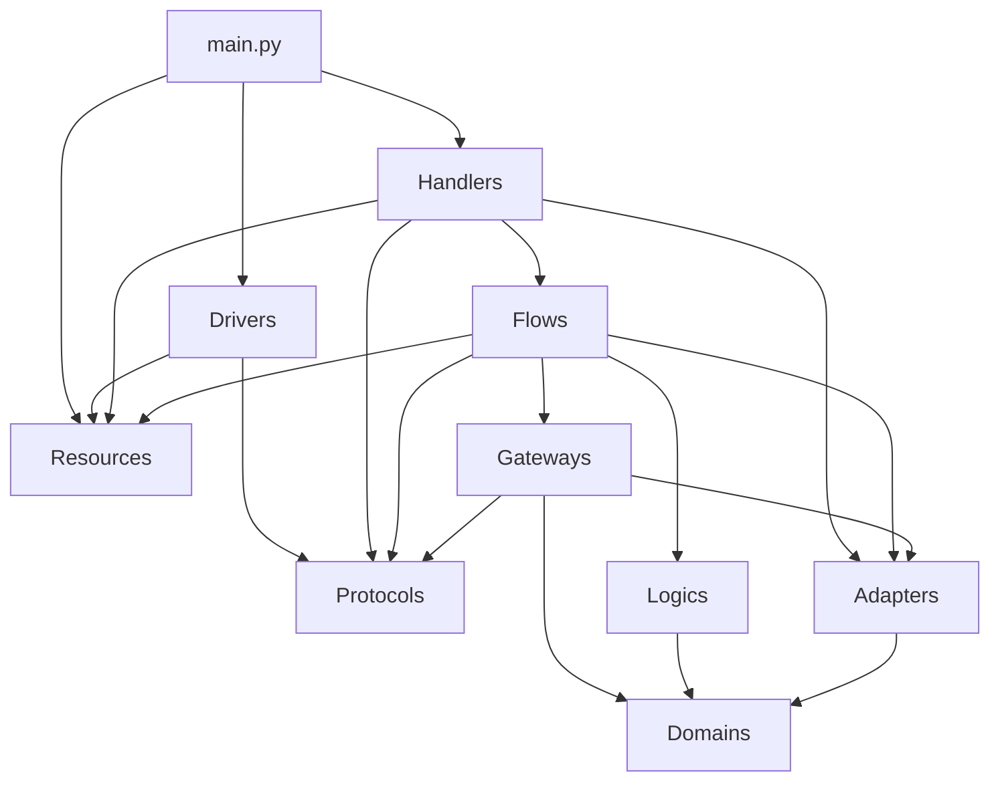

# The Architecture of Gateways (TAG)

**Arquitetura de software centrada em domínio, funcional e pragmática.**

[](https://www.python.org/downloads/)
[](LICENSE)
[](CONTRIBUTING.md)

> Inspirada em Arquitetura Hexagonal, Diplomata (Nubank) e DOMA (Uber).

---

## Índice

- [Motivação](#motivação)
- [O que é TAG](#o-que-é-tag)
- [Princípios](#princípios)
- [Estrutura de Diretórios](#estrutura-de-diretórios)
- [Camadas e Responsabilidades](#camadas-e-responsabilidades)
- [Regras de Dependência](#regras-de-dependência)
- [Exemplo Prático: Criação de Usuário](#exemplo-prático-criação-de-usuário)
- [Testes](#testes)
- [Injeção de Dependência e main.py](#injeção-de-dependência-e-mainpy)
- [Tratamento de Erros](#tratamento-de-erros)
- [Versionamento de Schemas e Tolerant Reader](#versionamento-de-schemas-e-tolerant-reader)
- [Comparação com Outras Arquiteturas](#comparação-com-outras-arquiteturas)
- [FAQ](#faq)
- [Contribuindo](#contribuindo)
- [Licença](#licença)

---

## Motivação

O desejo de criar uma arquitetura funcional que padronize o desenvolvimento de aplicações nasceu há mais de 5 anos, quando fundei minha primeira startup, a PayParty. Embora a empresa não tenha prosperado por questões de timing e modelo de negócio, foi nela que comecei a adotar padrões de projeto rigorosos para facilitar a adoção de novas funcionalidades, manter código sustentável e garantir que qualquer engenheiro soubesse onde encontrar o que precisava.

Naquela época, usando JavaScript puro e Express.js no backend, construí serviços padronizados mesmo sem saber que estava aplicando conceitos de arquitetura que mais tarde se tornariam fundamentais para mim. Era uma busca intuitiva por consistência e previsibilidade.

Esse sentimento ficou ainda mais forte ao ingressar no **Nubank**. Lá, observei que todos os serviços seguiam um padrão consistente para tudo: bibliotecas, frameworks, tecnologias e arquitetura. A empresa adotava o Diplomata, uma arquitetura de software bem estabelecida para serviços em Clojure. Foi no Nubank que meus pensamentos se consolidaram. A arquitetura padronizada trazia benefícios tangíveis: integração rápida de novos desenvolvedores, código previsível, qualidade consistente e evolução coordenada.

Ao ingressar na **Stone** como Staff Engineer, encontrei o cenário oposto: não havia padrão arquitetural para nada. Cada time, cada projeto, seguia uma abordagem diferente. O caos arquitetural gerava dificuldade de colaboração entre times, curva de aprendizado alta ao mudar de contexto, código inconsistente e retrabalho constante.

Foi na Stone que tudo se conectou. A experiência da PayParty me ensinou a valorizar padrões. O Nubank me mostrou que padrões funcionam em escala. A Stone me deu o contexto e a urgência para criar algo novo.

Assim nasceu **TAG (The Architecture of Gateways)**: uma arquitetura pragmática, funcional e centrada em domínio, forjada por anos de experiência desde a fundação de uma startup até a atuação como Staff Engineer em fintechs de escala global.

---

## O que é TAG

TAG (The Architecture of Gateways) é um padrão arquitetural que fornece uma visão **tática** e **estratégica** para desenvolver soluções de software centradas em domínio.

**Visão estratégica**: inspirada pelo DOMA (Uber), TAG orienta como organizar domínios, serviços e suas fronteiras em nível organizacional. Serviços são agrupados por domínio de negócio, com gateways como pontos de entrada que encapsulam a complexidade interna.

**Visão tática**: inspirada pelo Diplomata (Nubank) e pela Arquitetura Hexagonal, TAG define como estruturar o código dentro de cada serviço. Cada serviço segue a mesma organização de camadas, garantindo previsibilidade e consistência entre times.

Os pilares fundamentais:

- **Programação funcional**: imutabilidade, funções puras e composição via pipelines
- **Orientação ao domínio**: regras de negócio isoladas e centrais
- **Programação orientada a trilhos**: composição de Results para tratamento de erros explícito
- **Injeção de dependência baseada em Protocol**: testabilidade sem dependência de infraestrutura
- **Comunicação agnóstica**: microsserviços podem implementar qualquer tipo de comunicação (HTTP, gRPC, mensageria, streaming)

---

## Princípios

| # | Princípio | Descrição |
|---|-----------|-----------|
| 1 | **Protocols definem contratos** | Toda dependência de infraestrutura é abstraída por um Protocol. Trocar a implementação não afeta o domínio. |
| 2 | **Domains são schemas, nunca funções** | Entidades de domínio são definições de dados imutáveis. Lógica de negócio fica em Logics e Flows. |
| 3 | **Logics são puras** | Funções de lógica de domínio nunca fazem IO. Recebem dados, retornam dados. |
| 4 | **Adapters transformam estruturas** | Convertem dados entre formatos sem efeitos colaterais. Garantem imutabilidade na fronteira entre camadas. |
| 5 | **Gateways fazem IO** | Toda comunicação com o mundo externo (banco, APIs, filas) passa por Gateways, que recebem Protocols como parâmetro. |
| 6 | **Flows são pipelines de orquestração** | Cada caso de uso é um Flow que compõe Gateways, Logics e Adapters em um pipeline. |
| 7 | **Handlers conectam transporte a Flows** | Handlers são responsáveis pelo ciclo de vida de um dado, da entrada à saída. Chamam Adapters e Flows. |
| 8 | **Drivers implementam Protocols** | Toda biblioteca externa é encapsulada em um Driver que implementa um Protocol. Drivers vivem fora do código de domínio. |
| 9 | **IO nas bordas** | Efeitos colaterais são isolados nos Gateways e Drivers. O núcleo da aplicação é puro. |

### Inspirações

| Arquitetura | O que TAG absorveu |
|---|---|
| **Hexagonal (Portas e Adaptadores)** | Isolamento do domínio via portas (Protocols) e adaptadores (Drivers). Tecnologia é substituível sem impacto no negócio. |
| **Diplomata (Nubank)** | Estrutura padronizada para todos os serviços. Separação explícita entre lógica pura e impura. Camada de Adapter como fronteira de dados. |
| **DOMA (Uber)** | Organização de microsserviços por domínio. Gateways como ponto de entrada único de um domínio. Design de camadas para controle de dependências entre serviços. |
| **Programação orientada a trilhos** | Composição de pipelines com tipos Result. Erros propagam automaticamente sem exceções. |

---

## Estrutura de Diretórios

```
project-root/
├── src/
│   ├── protocols/          # Contratos de infraestrutura (typing.Protocol)
│   ├── domains/            # Entidades e objetos de valor (Pydantic schemas)
│   ├── resources/          # Configs, queries e schemas estáticos
│   ├── logics/             # Funções puras de domínio
│   ├── adapters/           # Transformações de dados entre camadas
│   ├── gateways/           # Acesso ao mundo externo via Protocols (IO)
│   ├── flows/              # Pipelines de casos de uso (orquestração)
│   │   └── user/           # Organizados por domínio
│   ├── handlers/           # Pontos de entrada (HTTP, Kafka, cron, etc.)
│   └── main.py             # Composição e injeção de dependência
├── drivers/                # Implementações de libs externas (fora do src/)
├── tests/
│   ├── unit/               # Testes de Adapters e Logics
│   └── integration/        # Testes de Flows completos
├── pyproject.toml
└── README.md
```

Pontos importantes:

- Todas as camadas de negócio ficam dentro de `src/`.
- `drivers/` fica **fora** de `src/`, no mesmo nível. Drivers são infraestrutura, não domínio. Eles implementam Protocols e são instanciados exclusivamente no `main.py`.
- `tests/` fica no mesmo nível de `src/`, com subdiretórios `unit/` e `integration/`.
- Todos os arquivos e módulos seguem `snake_case`.
- Flows são organizados por domínio (ex: `flows/user/create_user_flow.py`, `flows/order/cancel_order_flow.py`).

---

## Camadas e Responsabilidades

### Protocols

Protocols definem os contratos entre o domínio da aplicação e a infraestrutura. Utilizam `typing.Protocol` do Python (PEP 544) para subtipagem estrutural: qualquer classe que implemente os métodos exigidos satisfaz o contrato automaticamente, sem necessidade de herança.

Aqui ficam as abstrações protocolares de servidores HTTP, streaming, gRPC, logging, acesso a banco de dados, clientes HTTP para chamadas externas e qualquer outra dependência de infraestrutura.

**Regras**:
- Não dependem de nenhuma outra camada
- Apenas assinaturas de métodos, sem implementação
- Não importam bibliotecas externas

```python
# src/protocols/database.py
from typing import Protocol, Any
from returns.result import ResultE


class DatabaseClient(Protocol):
    def execute(
        self, query: str, params: dict[str, Any]
    ) -> ResultE[list[dict[str, Any]]]: ...
```

```python
# src/protocols/http_client.py
from typing import Protocol, Any
from returns.result import ResultE


class HttpClient(Protocol):
    def get(self, url: str, headers: dict[str, str]) -> ResultE[dict[str, Any]]: ...
    def post(self, url: str, body: dict[str, Any]) -> ResultE[dict[str, Any]]: ...
```

```python
# src/protocols/logger.py
from typing import Protocol, Any


class Logger(Protocol):
    def info(self, message: str, **context: Any) -> None: ...
    def error(self, message: str, **context: Any) -> None: ...
```

### Domains

Domains contém as entidades de domínio, objetos de valor e schemas. São definidos com Pydantic (`BaseModel` com `frozen=True`) para garantir imutabilidade e validação em tempo de execução.

**Regras**:
- Somente schemas, **nunca** funções
- Não dependem de nenhuma outra camada
- Podem ser usados por Gateways, Flows, Adapters e Resources

```python
# src/domains/user.py
from pydantic import BaseModel, ConfigDict, EmailStr
from uuid import UUID


class User(BaseModel):
    model_config = ConfigDict(frozen=True)

    id: UUID
    email: EmailStr
    name: str


class CreateUserInput(BaseModel):
    model_config = ConfigDict(frozen=True)

    email: EmailStr
    name: str


class CreateUserOutput(BaseModel):
    model_config = ConfigDict(frozen=True)

    id: str
    email: str
    name: str
```

### Resources

Resources são arquivos estáticos, configurações e schemas de referência. Podem ser definidos em Python (como schemas Pydantic ou constantes), YAML ou JSON. Não devem conter funções.

**Regras**:
- Somente schemas e constantes, sem funções
- Não dependem de nenhuma outra camada
- Podem ser usados por Flows, Handlers e Drivers

```python
# src/resources/settings.py
from pydantic import BaseModel, ConfigDict


class Settings(BaseModel):
    model_config = ConfigDict(frozen=True)

    database_url: str
    http_port: int = 8000
    log_level: str = "info"
```

```python
# src/resources/user_queries.py
INSERT_USER = """
    INSERT INTO users (id, email, name)
    VALUES (:id, :email, :name)
    RETURNING id, email, name
"""

FIND_USER_BY_EMAIL = """
    SELECT id, email, name FROM users WHERE email = :email
"""
```

### Logics

Logics são funções puras, compartilhadas e com foco em domínio. Executam validações, cálculos e transformações de regra de negócio. Nunca fazem IO.

**Regras**:
- Funções puras, sem efeitos colaterais
- Nunca chamam Flows ou Gateways (proibido IO)
- Podem usar Domains para anotações de tipo
- São chamadas exclusivamente por Flows

```python
# src/logics/user_logic.py
from returns.result import Result, Success, Failure


BLOCKED_EMAIL_DOMAINS = {"tempmail.com", "disposable.com", "throwaway.email"}


def validate_email_domain(email: str) -> Result[str, str]:
    domain = email.split("@")[-1].lower()
    if domain in BLOCKED_EMAIL_DOMAINS:
        return Failure(f"Domínio de email não permitido: {domain}")
    return Success(email)


def ensure_user_not_exists(rows: list[dict]) -> Result[None, str]:
    if len(rows) > 0:
        return Failure("Usuário já cadastrado com este email")
    return Success(None)
```

### Adapters

Adapters são adaptadores de entrada e saída. Têm o papel fundamental de garantir imutabilidade na fronteira entre camadas, transformando um schema em outro. Por exemplo, transformam dados de uma request HTTP em dados do domínio, ou dados do domínio em uma response HTTP.

**Regras**:
- Funções puras, sem efeitos colaterais
- Dependem apenas de Domains
- Nunca fazem IO
- Podem ser chamados por Flows, Gateways e Handlers

```python
# src/adapters/user_adapter.py
from uuid import uuid4
from src.domains.user import User, CreateUserInput, CreateUserOutput


def to_user_domain(input_data: CreateUserInput) -> User:
    return User(
        id=uuid4(),
        email=input_data.email,
        name=input_data.name,
    )


def to_create_user_output(user: User) -> CreateUserOutput:
    return CreateUserOutput(
        id=str(user.id),
        email=user.email,
        name=user.name,
    )


def to_create_user_input(raw: dict) -> CreateUserInput:
    return CreateUserInput(**raw)
```

### Gateways

Gateways são as implementações de acesso externo: chamadas HTTP, consumo de mensagens, inserção e consulta a banco de dados. Recebem Protocols como parâmetro para executar operações de IO (post, put, insert, query, etc).

Gateways são "funcionalmente puras" no sentido de que todas as dependências são recebidas explicitamente como parâmetro. Não acessam estado global nem instanciam nada internamente. O IO é delegado inteiramente ao Protocol recebido.

**Regras**:
- Recebem Protocols como parâmetro
- Podem usar Domains e Adapters
- Nunca chamam Flows, Handlers ou Logics
- São chamados exclusivamente por Flows

```python
# src/gateways/user_gateway.py
from typing import Any
from returns.result import ResultE
from src.protocols.database import DatabaseClient
from src.domains.user import User
from src.resources.user_queries import INSERT_USER, FIND_USER_BY_EMAIL


def find_user_by_email(
    db: DatabaseClient, email: str
) -> ResultE[list[dict[str, Any]]]:
    return db.execute(FIND_USER_BY_EMAIL, {"email": email})


def persist_user(db: DatabaseClient, user: User) -> ResultE[list[dict[str, Any]]]:
    return db.execute(INSERT_USER, user.model_dump())
```

### Flows

Flows são os casos de uso da aplicação. Orquestram a lógica de negócio compondo Gateways, Logics e Adapters em um pipeline. Recebem Protocols como parâmetro (injetados pelos Handlers). São geralmente funções impuras, pois interagem com Gateways que fazem IO.

Um Flow pode ser entendido como uma funcionalidade de um determinado domínio. Tendem a ser funções orquestradoras por coordenar múltiplas operações.

**Regras**:
- Recebem Protocols como parâmetro
- Podem chamar Gateways, Logics e Adapters
- Podem usar Resources
- Nunca chamam Handlers ou Drivers
- São chamados exclusivamente por Handlers
- Organizados por domínio (ex: `flows/user/`, `flows/order/`)

```python
# src/flows/user/create_user_flow.py
from returns.result import Result, Success
from returns.pipeline import flow
from returns.pointfree import bind, map_
from src.protocols.database import DatabaseClient
from src.domains.user import CreateUserInput, CreateUserOutput
from src.logics.user_logic import validate_email_domain, ensure_user_not_exists
from src.gateways.user_gateway import find_user_by_email, persist_user
from src.adapters.user_adapter import to_user_domain, to_create_user_output


def create_user_flow(
    db: DatabaseClient,
    input_data: CreateUserInput,
) -> Result[CreateUserOutput, str]:
    return flow(
        validate_email_domain(input_data.email),
        bind(lambda email: find_user_by_email(db, email)),
        bind(ensure_user_not_exists),
        bind(lambda _: Success(to_user_domain(input_data))),
        bind(lambda user: persist_user(db, user).map(lambda _: user)),
        map_(to_create_user_output),
    )
```

### Handlers

Handlers são responsáveis por manipular o ciclo de vida de um determinado dado, desde a sua entrada até a sua saída. São os pontos de conexão entre o transporte (HTTP, Kafka, cron, gRPC) e os Flows.

Exemplos de Handlers: handlers chamados por requisições HTTP, consumidores Kafka, producers Kafka, cronjobs.

**Regras**:
- Recebem Protocols e Resources como parâmetro
- Podem chamar Adapters e Flows
- Nunca chamam Gateways, Logics ou Drivers diretamente
- São registrados no `main.py` via Drivers

```python
# src/handlers/user_handlers.py
from typing import Any
from returns.result import Success, Failure
from src.protocols.database import DatabaseClient
from src.protocols.logger import Logger
from src.adapters.user_adapter import to_create_user_input
from src.flows.user.create_user_flow import create_user_flow


def handle_create_user(
    db: DatabaseClient,
    logger: Logger,
    raw_body: dict[str, Any],
) -> tuple[int, dict[str, Any]]:
    input_data = to_create_user_input(raw_body)
    result = create_user_flow(db, input_data)

    match result:
        case Success(output):
            return 201, output.model_dump()
        case Failure(error):
            logger.error("Falha ao criar usuário", error=error)
            return 400, {"error": error}
```

```python
# src/handlers/user_handlers.py (registro de rotas)
from src.protocols.database import DatabaseClient
from src.protocols.http_server import HttpServer
from src.protocols.logger import Logger


def register_user_handlers(
    http: HttpServer,
    db: DatabaseClient,
    logger: Logger,
) -> None:
    http.post(
        "/users",
        lambda body: handle_create_user(db, logger, body),
    )
```

### Drivers

Drivers são as implementações de toda e qualquer biblioteca que o projeto precisa. São orientados pela necessidade do domínio da aplicação e seus casos de uso. Sempre implementam Protocols.

**Regras**:
- Ficam **fora** de `src/`, no diretório `drivers/`
- Sempre implementam um Protocol
- Podem usar Resources
- São instanciados exclusivamente no `main.py`
- Nunca são importados por Flows, Gateways, Logics ou Adapters

```python
# drivers/postgres_driver.py
from typing import Any
from returns.result import ResultE, safe
from src.protocols.database import DatabaseClient
from src.resources.settings import Settings
import psycopg2
import psycopg2.extras


class PostgresDriver:
    """Implementa DatabaseClient usando psycopg2."""

    def __init__(self, settings: Settings) -> None:
        self._conn = psycopg2.connect(settings.database_url)

    @safe
    def execute(
        self, query: str, params: dict[str, Any]
    ) -> list[dict[str, Any]]:
        cursor = self._conn.cursor(cursor_factory=psycopg2.extras.RealDictCursor)
        cursor.execute(query, params)
        return cursor.fetchall()
```

```python
# drivers/fastapi_driver.py
from typing import Any, Callable
from fastapi import FastAPI, Request
from uvicorn import run as uvicorn_run
from src.protocols.http_server import HttpServer


class FastAPIDriver:
    """Implementa HttpServer usando FastAPI."""

    def __init__(self) -> None:
        self._app = FastAPI()

    def post(
        self, path: str, handler: Callable[[dict[str, Any]], tuple[int, dict[str, Any]]]
    ) -> None:
        @self._app.post(path)
        async def route(request: Request) -> dict[str, Any]:
            body = await request.json()
            status, response = handler(body)
            return response

    def start(self, port: int) -> None:
        uvicorn_run(self._app, host="0.0.0.0", port=port)
```

---

## Regras de Dependência

### Matriz de Dependências

| Camada | Pode chamar | Não pode chamar |
|---|---|---|
| **Protocols** | nenhuma | todas |
| **Domains** | nenhuma | todas |
| **Resources** | nenhuma | todas |
| **Logics** | Domains | Flows, Gateways, Handlers, Adapters, Drivers |
| **Adapters** | Domains | Flows, Gateways, Handlers, Logics, Drivers |
| **Gateways** | Protocols, Domains, Adapters | Flows, Handlers, Logics, Drivers |
| **Flows** | Gateways, Logics, Adapters, Protocols, Resources | Handlers, Drivers |
| **Handlers** | Adapters, Flows, Protocols, Resources | Gateways, Logics, Drivers |
| **Drivers** | Protocols, Resources | Handlers, Flows, Gateways, Logics, Adapters |
| **main.py** | Drivers, Handlers, Resources | Flows, Gateways, Logics, Adapters |

### Diagrama de Dependências



### Fluxo de uma Requisição

O ciclo de vida de uma requisição na TAG segue este caminho:

```
Request --> Driver --> Handler --> Adapter --> Flow --> Gateway --> Protocol (IO)
                                                  --> Logic (puro)
                                                  --> Adapter (transformação)
                                              <-- Result
                         Handler <-- Adapter <-- Result
Response <-- Driver <-- Handler
```

1. Uma requisição chega (HTTP, mensagem Kafka, trigger de cron, etc.)
2. O Driver (ex: FastAPI) recebe e encaminha para o Handler registrado
3. O Handler usa um Adapter para transformar a entrada raw em dados do domínio
4. O Handler chama um Flow, passando Protocols e os dados adaptados
5. O Flow orquestra: chama Logics para validações puras, Gateways para IO, Adapters para transformações
6. O Flow retorna um `Result` (Success ou Failure)
7. O Handler trata o Result e retorna a resposta via Driver

---

## Exemplo Prático: Criação de Usuário

Este exemplo mostra todas as camadas trabalhando juntas para implementar a criação de um usuário.

### Estrutura de arquivos do exemplo

```
project-root/
├── src/
│   ├── protocols/
│   │   ├── database.py
│   │   ├── http_server.py
│   │   └── logger.py
│   ├── domains/
│   │   └── user.py
│   ├── resources/
│   │   ├── settings.py
│   │   └── user_queries.py
│   ├── logics/
│   │   └── user_logic.py
│   ├── adapters/
│   │   └── user_adapter.py
│   ├── gateways/
│   │   └── user_gateway.py
│   ├── flows/
│   │   └── user/
│   │       └── create_user_flow.py
│   ├── handlers/
│   │   └── user_handlers.py
│   └── main.py
├── drivers/
│   ├── fastapi_driver.py
│   └── postgres_driver.py
└── tests/
    ├── unit/
    │   ├── test_user_adapter.py
    │   └── test_user_logic.py
    └── integration/
        └── test_create_user_flow.py
```

### main.py

```python
# src/main.py
from drivers.fastapi_driver import FastAPIDriver
from drivers.postgres_driver import PostgresDriver
from drivers.structlog_driver import StructlogDriver
from src.resources.settings import load_settings
from src.handlers.user_handlers import register_user_handlers


def create_app() -> FastAPIDriver:
    settings = load_settings()

    db = PostgresDriver(settings)
    logger = StructlogDriver(settings)
    http = FastAPIDriver()

    register_user_handlers(http, db, logger)

    return http


def main() -> None:
    app = create_app()
    app.start(port=8000)


if __name__ == "__main__":
    main()
```

---

## Testes

A estratégia de testes da TAG é diretamente ligada à separação entre funções puras e impuras.

### Testes Unitários

Testes unitários cobrem **Adapters** e **Logics**: as camadas que são funções puras e sem efeitos colaterais. Não dependem de infraestrutura, não precisam de mocks pesados. Recebem dados, retornam dados.

```python
# tests/unit/test_user_logic.py
from src.logics.user_logic import validate_email_domain, ensure_user_not_exists


def test_validate_email_domain_aceita_dominio_valido():
    result = validate_email_domain("user@gmail.com")
    assert result.unwrap() == "user@gmail.com"


def test_validate_email_domain_rejeita_dominio_bloqueado():
    result = validate_email_domain("user@tempmail.com")
    assert result.failure()


def test_ensure_user_not_exists_sucesso_quando_vazio():
    result = ensure_user_not_exists([])
    assert result.unwrap() is None


def test_ensure_user_not_exists_falha_quando_existe():
    result = ensure_user_not_exists([{"id": "123", "email": "a@b.com"}])
    assert result.failure()
```

```python
# tests/unit/test_user_adapter.py
from src.adapters.user_adapter import to_user_domain, to_create_user_output
from src.domains.user import CreateUserInput, User
from uuid import UUID


def test_to_user_domain_cria_user_com_uuid():
    input_data = CreateUserInput(email="user@example.com", name="Test User")
    user = to_user_domain(input_data)

    assert isinstance(user.id, UUID)
    assert user.email == "user@example.com"
    assert user.name == "Test User"


def test_to_create_user_output_converte_corretamente():
    user = User(
        id=UUID("12345678-1234-5678-1234-567812345678"),
        email="user@example.com",
        name="Test User",
    )
    output = to_create_user_output(user)

    assert output.id == "12345678-1234-5678-1234-567812345678"
    assert output.email == "user@example.com"
```

### Testes de Integração

Testes de integração cobrem **Flows** completos. Testam o fluxo de ponta a ponta, incluindo a interação entre Gateways, Logics e Adapters. Recebem **Protocols** como parâmetro, usando implementações falsas ou em memória ao invés de infraestrutura real.

Desta forma, testamos fluxo e lógica de negócio, não bibliotecas e infraestrutura.

```python
# tests/integration/fake_database.py
from typing import Any
from returns.result import ResultE, Success, Failure


class FakeDatabaseClient:
    """Implementa DatabaseClient Protocol para testes."""

    def __init__(self) -> None:
        self._store: list[dict[str, Any]] = []

    def execute(
        self, query: str, params: dict[str, Any]
    ) -> ResultE[list[dict[str, Any]]]:
        if "SELECT" in query:
            matches = [
                row for row in self._store
                if all(row.get(k) == v for k, v in params.items())
            ]
            return Success(matches)

        if "INSERT" in query:
            self._store.append(params)
            return Success([params])

        return Failure(Exception(f"Query não suportada: {query}"))
```

```python
# tests/integration/test_create_user_flow.py
from tests.integration.fake_database import FakeDatabaseClient
from src.flows.user.create_user_flow import create_user_flow
from src.domains.user import CreateUserInput


def test_create_user_flow_sucesso():
    db = FakeDatabaseClient()
    input_data = CreateUserInput(email="new@example.com", name="New User")

    result = create_user_flow(db, input_data)

    assert result.unwrap().email == "new@example.com"


def test_create_user_flow_falha_email_bloqueado():
    db = FakeDatabaseClient()
    input_data = CreateUserInput(email="user@tempmail.com", name="Temp User")

    result = create_user_flow(db, input_data)

    assert result.failure()


def test_create_user_flow_falha_usuario_existente():
    db = FakeDatabaseClient()
    db._store.append({"email": "exists@example.com", "name": "Existing"})
    input_data = CreateUserInput(email="exists@example.com", name="Duplicate")

    result = create_user_flow(db, input_data)

    assert result.failure()
```

### Resumo da estratégia

| Tipo | O que testa | Camadas testadas | Dependências de infra |
|---|---|---|---|
| **Unit** | Funções puras isoladas | Adapters, Logics | Nenhuma |
| **Integração** | Fluxo completo do caso de uso | Flows (com Gateways, Logics, Adapters) | Protocols falsos (em memória) |

---

## Injeção de Dependência e main.py

A injeção de dependência na TAG segue um modelo simples e funcional: Drivers são instanciados no `main.py` e passados como Protocols para Handlers, que por sua vez os repassam para Flows e Gateways.

Não há necessidade de frameworks de DI. A composição acontece de forma explícita no `main.py`:

```
main.py
  |-- instancia Drivers (que implementam Protocols)
  |-- passa Protocols para funções de registro de Handlers
       |-- Handlers recebem Protocols como parâmetro
            |-- Handlers passam Protocols para Flows
                 |-- Flows passam Protocols para Gateways
```

Este modelo garante que:

1. **Nenhuma camada de domínio importa implementações concretas.** Flows e Gateways dependem apenas de Protocols.
2. **Trocar infraestrutura é trocar uma linha no `main.py`.** Mudar de PostgreSQL para DynamoDB é instanciar um Driver diferente.
3. **Testes usam Protocols falsos.** Não precisam de containers Docker ou simulações complexas.

---

## Tratamento de Erros

TAG adota o padrão **Either Monad** via `Result` da biblioteca `dry-python/returns`. Toda operação que pode falhar retorna `Result[SuccessType, FailureType]` ao invés de levantar exceptions.

### Por que Result ao invés de exceptions

- **Explicitação**: o tipo de retorno documenta que a função pode falhar
- **Composição**: Results se compõem via `bind`, `map_` e `flow` em pipelines
- **Segurança**: o verificador de tipos valida que falhas são tratadas
- **Padrão de trilhos**: em um pipeline, a primeira falha propaga automaticamente até o final, sem necessidade de try/catch em cada etapa

### Operações principais

```python
from returns.result import Result, Success, Failure
from returns.pipeline import flow
from returns.pointfree import bind, map_

# Criar Results
success: Result[int, str] = Success(42)
failure: Result[int, str] = Failure("not found")

# map_: transforma o valor de sucesso
Success(10).map(lambda x: x * 2)      # Success(20)
Failure("err").map(lambda x: x * 2)   # Failure("err")

# bind: encadeia operações que retornam Result
Success(10).bind(lambda x: Success(x * 2) if x > 0 else Failure("negativo"))

# flow: compõe um pipeline completo
result = flow(
    Success(input_data),
    bind(validate),
    bind(transform),
    bind(persist),
    map_(format_output),
)
```

### O decorator `@safe`

Converte funções que levantam exceptions em funções que retornam `Result`:

```python
from returns.result import safe

@safe
def parse_json(raw: str) -> dict:
    import json
    return json.loads(raw)

parse_json('{"ok": true}')    # Success({"ok": True})
parse_json('invalid')          # Failure(JSONDecodeError(...))
```

### Onde usar Result na TAG

| Camada | Usa Result? | Motivo |
|---|---|---|
| **Protocols** | Sim, nos retornos | Define que operações de IO podem falhar |
| **Gateways** | Sim, nos retornos | IO pode falhar, Result torna isso explícito |
| **Logics** | Sim, nos retornos | Validações retornam Success ou Failure |
| **Flows** | Sim, nos retornos | Pipeline composto de Results via flow/bind |
| **Adapters** | Não | Transformações puras que não falham |
| **Handlers** | Consome Results | Faz correspondência de padrão no Result do Flow |

---

## Versionamento de Schemas e Tolerant Reader

TAG adota o padrão **Tolerant Reader** (Martin Fowler) para lidar com evolução de contratos entre serviços, seguindo a Lei de Postel:

> "Seja conservador no que envia, seja liberal no que aceita."

### Princípios aplicados

1. **Adapters como fronteira de tolerância**: os Adapters de entrada devem extrair apenas os campos necessários do payload recebido, ignorando campos desconhecidos. Isso significa que um serviço upstream pode adicionar novos campos sem quebrar consumidores.

2. **Domains com Pydantic**: ao usar `model_config = ConfigDict(frozen=True)`, Pydantic valida e aceita apenas os campos definidos. Para tolerância, Adapters fazem a filtragem antes de construir o Domain.

3. **Resources como mapa de dependências**: arquivos de configuração em `resources/` declaram quais endpoints e serviços externos a aplicação consome, incluindo URLs e contratos esperados.

### Validação automatizada de contratos

Uma abordagem para detectar mudanças incompatíveis entre serviços:

```yaml
# src/resources/external_contracts.yaml
dependencies:
  - service: payment-service
    endpoints:
      - method: POST
        path: /api/v1/payments
        expected_fields:
          - amount
          - currency
          - user_id
  - service: notification-service
    endpoints:
      - method: POST
        path: /api/v1/notifications
        expected_fields:
          - recipient
          - message
```

Uma GitHub Action pode validar periodicamente que:

1. Os endpoints mapeados em `resources/` ainda respondem
2. Os campos que os Adapters esperam ainda existem nos contratos das APIs externas
3. Alterações nos Adapters são compatíveis com os contratos declarados

Isso cria um mecanismo automatizado de **teste de contratos orientado ao consumidor**, onde o consumidor (este serviço) declara suas expectativas e valida proativamente se elas continuam sendo atendidas.

---

## Comparação com Outras Arquiteturas

| Aspecto | TAG | Hexagonal | Arquitetura Limpa | DOMA (Uber) | Diplomata (Nubank) |
|---|---|---|---|---|---|
| **Paradigma** | Funcional | Agnóstico | OOP | Agnóstico | Funcional (Clojure) |
| **Escopo** | Serviço + organização | Serviço | Serviço | Organização | Serviço |
| **Organização interna** | Por domínio (Flows) | Por camada | Por camada | Não define | Por camada |
| **Handlers** | Ciclo de vida do dado | Controladores | Controladores | Não define | Adapters |
| **Tratamento de erros** | Either/Result | Não define | Não define | Não define | Não define |
| **Injeção de dependência** | Baseado em Protocol, funcional | Portas | Baseado em interface | Não define | Baseado em componentes |
| **IO** | Isolado em Gateways | Isolado em Adapters | Isolado em Gateways | Atrás de Gateways | Isolado em Portas |
| **Visão estratégica** | Sim (inspirado no DOMA) | Não | Não | Sim | Parcial |

TAG combina a visão estratégica do DOMA (domínios, gateways entre serviços, design de camadas) com a visão tática do Diplomata (estrutura padronizada dentro de cada serviço), adicionando: tratamento de erros explícito com Either/Result, tipo Protocol do Python para injeção de dependência sem herança, e organização por domínio ao invés de por camada.

---

## FAQ

<details>
<summary><strong>TAG funciona com qualquer framework HTTP?</strong></summary>

Sim. O framework HTTP é encapsulado em um Driver que implementa o Protocol `HttpServer`. FastAPI, Flask, Starlette ou qualquer outro framework pode ser usado. A troca é feita no `main.py` sem impacto no código de domínio.

</details>

<details>
<summary><strong>Posso usar TAG com Django?</strong></summary>

Sim, mas requer adaptação. O Django é opinativo sobre estrutura de projeto. O Driver de Django encapsularia as views e o ORM, expondo-os via Protocols. O código de domínio (Flows, Logics, Adapters) permanece intacto.

</details>

<details>
<summary><strong>Por que Drivers ficam fora de src/?</strong></summary>

Drivers são infraestrutura, encapsulam bibliotecas externas. Mantê-los fora de `src/` reforça a separação entre domínio e infraestrutura. Nenhuma camada dentro de `src/` pode importar diretamente um Driver. A única conexão é via `main.py`, que instancia Drivers e injeta como Protocols.

</details>

<details>
<summary><strong>Quando devo criar um novo Flow vs adicionar lógica a um existente?</strong></summary>

Cada Flow representa um caso de uso do domínio. Se a operação é um caso de uso distinto (ex: criar usuário vs bloquear usuário), crie um novo Flow. Se é uma variação do mesmo caso de uso, pode ser uma ramificação dentro do Flow existente.

</details>

<details>
<summary><strong>TAG é adequada para monólitos?</strong></summary>

Sim. A estrutura de camadas funciona tanto para microsserviços quanto para monólitos. Em um monólito, você teria múltiplos domínios dentro de `flows/`, cada um com seus Gateways, Adapters e Logics. Os Protocols garantem que os domínios não se acoplam diretamente à infraestrutura.

</details>

<details>
<summary><strong>Como lidar com operações assíncronas (async/await)?</strong></summary>

Os Protocols podem definir métodos assíncronos. A biblioteca `returns` oferece `FutureResult` para operações async que podem falhar. Os Flows podem usar `async def` e `await` normalmente, mantendo a mesma estrutura de composição.

</details>

---

## Contribuindo

Contribuições são bem-vindas. Consulte o [Guia de Contribuição](CONTRIBUTING.md) para diretrizes detalhadas.

1. Fork o repositório
2. Crie uma branch (`git checkout -b feature/nova-feature`)
3. Siga os princípios TAG rigorosamente
4. Adicione testes para novos exemplos
5. Abra um Pull Request

---

## Licença

MIT License. Consulte [LICENSE](LICENSE) para detalhes.

---

**TAG Architecture v0.0.1**

[Star](https://github.com/whereisanzi/tag) | [Issues](https://github.com/whereisanzi/tag/issues) | [Discussões](https://github.com/whereisanzi/tag/discussions)
